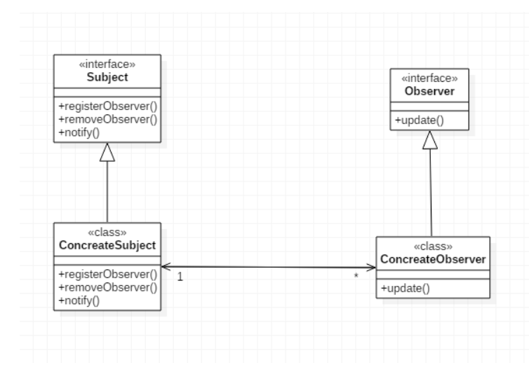
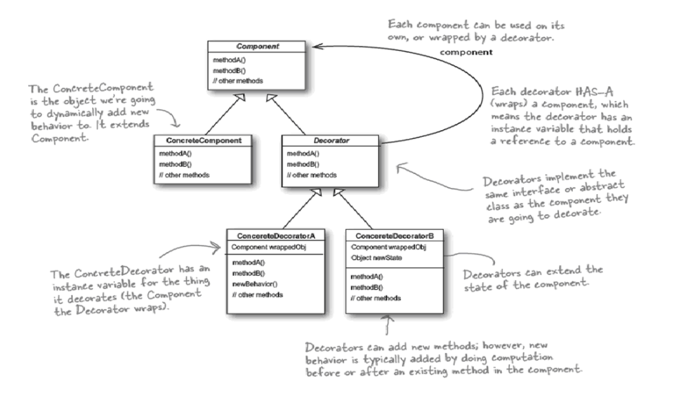
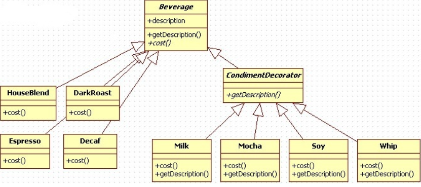
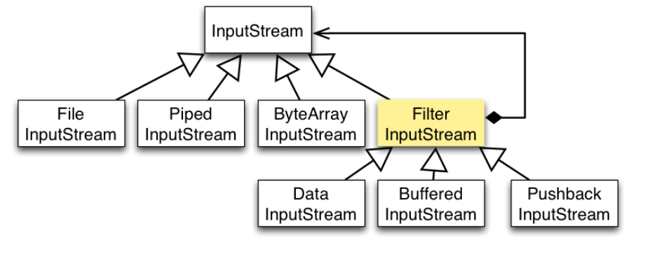
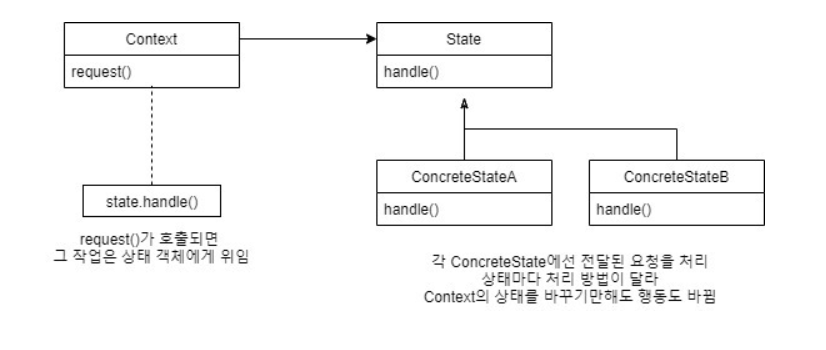
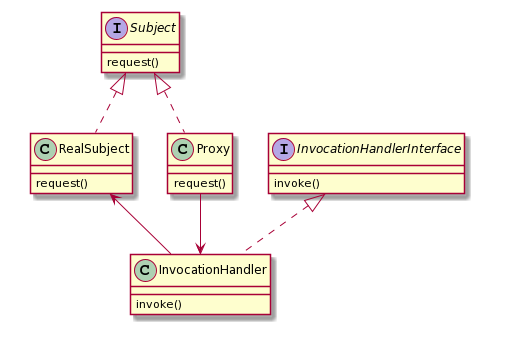

## 디자인 원칙
1. `달라지는 부분과 달라지지 않는 부분을 분리` 한다.   (스트래티지 패턴)
2. 상속보다는 구성을 활용한다.  ()
3. 구현보다 인터페이스에 맞춰서 프로그래밍한다.
4. 서로 상호 작용을 하는 객체 사이에는 가능하면 느슨하게 디자인을 사용해야한다.
5. 클래스는 확장에는 열려있고 변경에 대해서 닫혀 있어야한다.
6. 추상화 된것에 의존하라 구상 클래스에 의존하지 않도록한다.
7. 친한 친구들하고 대화하라
8. 먼저 연락하지 마세요 저희가 연락드리겠습니다.
9. 클래스를 바꾸는 이유는 한가지 뿐이어야합니다.
   + 클래스의 원래 역할(집합체 관리) 외에 다른 역할(반복자 메소드)을 처리하도록 하면 , 두 가지 이유로 인해 그 클래스가 바뀔 수 있습니다.
   + 

|패턴명| 패턴정의|언제사용해야할까?|
|:---:|:---:|:---:|
|스트래티지패턴|알고리즘 캡슐화|나중에 변경할 떄도 코드에 미치는 영향을 최소화 해야할 떄 요구사항이 수시로 변경되는 경우|
|옵저버패턴|객체간의 연락|어떤 객체의 상태가 바뀌거나 중요한 메소드가 호출 되었을 때 이와 관련된 객체들에게 소식을 전달할 수 있는 패턴이다.|
|데코레이터패턴|상속을 하지않고 확장| 상속을 통해 기능을 확장해야하는 경우가 있을 때 고려해볼 만하다.|


# 스트래지 패턴
+ 알고리즘을 캡슐화 하여 교환해서 사용할 있도록 만든패턴   
+ 클라이언트에서 독립적으로 알고리즘을 변경할 수 있다.

## 스트래티지 패턴을 사용하기 전 문제점은 무엇인가? 
1. 상속을 사용하여 구현 
   + 상속을 사용하는 것이 그리 성공적이지 못하다
     + 상속을 사용하게 된다면 많은 `변경점`이 찾아왔을 때 상속한 클래스마다 메소드를 전부 수정하게된다.
     + 서브클래스에서 코드가 중복된다.
     + 실행시에 특징을 바꿀수 없게 된다.
     + 코드를 변경했을 때 다른 오리들한테 원치 않느 영향을 끼칠 수 있다.
   + `상속` 한 클래스에게 `Flyable`, `Quackable` 인터페이스를 구현하게 하는 것은 어떤가?
     + 행동에 대한 코드의 재사용성을 떨어지게된다.
     + 코드 관리면에서도 문제점이 생기며 
     + 날수 있는 오리중에는 나는 방식도 다를 수있다.

    
## 위 문제를 해결하려면 어떻게 해야할까? 
1. 요구사항이 있을 때마다 바뀌는 부분과 바뀌지 않는 부분을 분리한다.
2. 바뀌는 부분을 `캡슐화` 하면된다.
   + 바뀌지 않는 부분에 영향을 미치지 않아 `수정` or `확장`에 용이하다

## 요구사항에 따라 바뀌는 부분은 어떤 메소드인가요?
+ 변경되는 부분들을  `클래스집합`으로 새로 만들도록합니다.
```java
public abstract class Duck {
    public void fly();
    public void quack();
}
```

## 나는 행동과 꽥꽥거리는 행동을 구현하는 `클래스 집합`은 어떻게 디자인해야할까요?
+ 이 문제의 시작은 오리의 행동의 변화 때문입니다.
+ 각각의 행동에 따른 `집합`을 만들어주는 인터페이스(추상화)를 이용해 설계합니다.
  + quackBehavior, flyBehavior

## 하지만 왜 인터페이스를 이용해야할까요?
- `인터페이스에 맞춰서 프로그래밍한다는` 것은 `상위` 형식에 맞춰서 프로그래밍한다는 것을 의미합니다.
- 반드시 자바의 인터페이스를 사용하는 것이 아니라 실제 실행시에 쓰이는 객체가   
  코드에 의해서 고정되지 않도록, 어떤 상위 형식에 맞춰서 프로그래밍함으로써 `다형성`을 활용해야한다는 것입니다.   
  그렇게 함으로써 좀더 유연할 설계를 할 수있게 됩니다.

## 무엇이 변한걸까요? 
1. Duck 클래스를 상속하던 여러가지 Duck 클래스들은 행동에 대해서는 `포함`관계로 변경됩니다.
2. 언제든지 `Runtime`시점에 해당 객체들은 변경할 수 있게 되는 것이죠 
3. Duck을 상속한 클래스들이 직접적으로 구현해어야했다면 이제는 필요에따라 인터페이스를 구현할 수있습니다.

## 구성을 살펴봅시다 .
|클래스명|용도|
|:---:|:---:|
|FlyBehavior| 나는 행동|
|QuackBehavior| 울음소리 행동|


## 코드를 살펴봅시다 
````java
public abstract class Duck {
    // 포함관계
    protected FlyBehavior flyBehavior;
    protected QuackBehavior quackBehavior;

    public void setFlyBehavior(FlyBehavior flyBehavior) {
        this.flyBehavior = flyBehavior;
    }

    public void setQuackBehavior(QuackBehavior quackBehavior) {
        this.quackBehavior = quackBehavior;
    }
    // 변화되는 행동을 실행하는 메소드 
    public void performQuack() {
        quackBehavior.quack();
    }
    // 변화되는 행동을 실행하는 메소드 
    public void performFly() {
        flyBehavior.fly();
    }


    public abstract void swim();

    public abstract void display();

}
````


#2 옵저버 패턴
+ 하나의 객체에 변경이 생겼을 때 다른 객체에게 알려주고 싶다면 어떻게해야할까요 ? 
그럴 때 사용 할 수 있는 패턴이 `옵저버패턴`입니다.
+ 한 객체의 상태가 바뀌면 그 객체에 의존하는 다른 객체들한테 연락이 가고 자동으로 내용이 갱신되는 방식입니다.
+ 상태를 지정하고 알림을 보내는 것의 주체는 `subject`

|명명|의미|
|:---:|:---:|
|Subject|상태를 저장하고 있는 객체, 옵저버로 등록, 탈퇴 하고싶을 때 |
|Observer|옵저버가 될 가능성이 있는 객체에서 반드시 해당 인터페이스를 구현해야합니다. `subject`가 변경될 때 호출되는 메소드는 `update()` 하나입니다.|
|ConcreateSubject|Subject의 구현 클래스로 구독,삭제,알림을 담당하고 있습니다.|
|ConcreteObserver|Observer 인터페이스만 구현한다면 무엇이든 옵저버 클래스가 될 수 있습니다.|

+ `Observer패턴`에서 `Subject`는 **일대 다** 의존성을 정의합니다.
    + `Observer` 하나의 `subject`에 의존하게 됩니다.
    + `subject` 상태가 바뀌면 `Observer` 에게 변경되었음을 알려줄 수 있습니다.
    + 연락 방법에 따라 옵저에 있는 값이 새로운 값으로 갱신될 수도 있습니다.
    + `subjectInterface` 와 옵저버 인터페이스가 들어있는 클래스 디자인을 바탕으로 설계되어 있습니다.

## 중요한 이야기 
+ 옵저 패턴에서 상태를 저장하고 지배하는 것은 `Subject`를 구현한 `ConcreteSubject` 입니다.
+ 상태가 들어있는 객체는 오직`하나`만 있을 수 있습니다.
+ `옵저버`는 상태를 꼭 필수로 가져야하는 것은 아닙니다 Subject의 변화가 본인에게 영향을 준다는게 핵심 내용이죠 
+ 데이터의 주인은 `subject`입니다. 여러객체에서 동일한 데이터를 사용하면 여러 객체에서 동일한 데이터를 제어하도록 하는 것에 비해 더 깔금한 객체지향을 할 수 있는 것이죠


## 느슨한 결합
+ 두 객체가 느슨하게 결합되어 있다는 것은 그 둘이 `상호 작용`을 하긴 하지만 `서로에 대해 서로 잘 모른다는 것`을 의미합니다.
+ `Subject`와 `Observer`가 느슨하게 결합되어 있는 객체 디자인 제공
+ `Subject`가 `Observer`에 대해서 아는 것은 `Observer`가 특정 인터페이스를 구현한다는 것입니다.
  + 구상클래스가 무엇을 하는지, 옵저버가 무엇을 하는지 등에 대해서는 알필요가 없는 것이죠 
+ `Observer`는 언제든지 새로 추가할 수 있습니다.
  + `Subject`는 Observer 인터페이스를 구현하는 객체의 목록에만 의존하기 때문에 언제든지새로운 옵저버를 추가할 수 있습니다.
  + 실행중에도 변경이 가능하며 추가,삭제도 가능하게됩니다.
+ 새로운 형식의 `Observer`가 생겨도 `Subject`를 변경할 필요가 없습니다.
+ `Subject`와 `Observer`바뀌더라도 서로한테 영향을 미치지 않습니다. 
  + 서로 느슨하게 있다는 것은 무엇이 바뀌어도 서로간에 영향을 주지 않기 때문입니다.


##2-1. 요구사항

+ 기상 정보 스테이션을 개발
  + Weather DATA 객체를 바탕으로 개발한다.
    + 기온, 습도, 기압 추적하는 객체이다.
  + 세개의 항목은 각각 `현재 조건`, `기상 통계`, `기상예보`를 최신 측정치를 수집할 때 실시간으로 갱신된다.
  + 다른 개발자들이 사용할 수 있도록 API를 만들 예정이다.

+ 정리 
  + 기상데이터를 사용하는 세개의 디스프레이 항목을 구현
    1. 현재조건을 표시
    2. 기상통계를 표시
    3. 기상예보를 표시
    4. WeatherData에서 새로운 측정값이 들어올 때마다 디스플레이스를 갱신해야한다.
    5. 시스템이 확장성이있어야한다.
       + 디스플레이 항목을 추가/제거할 수 있도록 해야한다.
         + 상위 1~3번 기능을 말함

```java

public class WeatherData {
    void getTemperature();  //온도 
    void getHumidity();     //습도
    void getPressure();     //기압

    /**
     * 기상 값이 갱신될 때마다 알려주기 위한 메소드
     * 현재조건, 기상통계, 기상예측
     */
    public void measurementsChanged() {
      float temp = getTemperature();
      float humidity = getHumidity();
      float pressure = getPressure();

      /**
       *  구체적인 구현에 맞춰서 코딩했기 때문에 프로그램을 고치지 않고서는 다른 디스플레이를 추가/삭제할 수 없다.
       *  파라미터는 동일한 인자값을 사용하고 있다는 것을 알 수있다.
       */
      currentConditionDisplay.update(temp, humidity, pressure);
      statisticsDisplay.update(temp, humidity, pressure);
      forecastDisplay.update(temp, humidity, pressure);
    }
} 
```


## 자바 API에서 제공하는 옵저버 패턴을 사용해봅시다.
+ 객체가 옵저가 되는 방법 
  + Observer 인터페이스를 구현 
  + Observable 객체의 addObserver() 메소를 호출
+ Observable 에 알리는 방법
  + setChanged 메소드를 호출해서 객체의 상태가 바뀌었다는 것을 알리는 것
  + notifyObbservers(), notifyObservers(Object arg)
+ Observer 연락을 받는 방법 
  ```java
    // 연락을 보내느 주체 객체가 인자로 전달
    /** 
       notifyObservers() 메소드에서 인자로 전달된 데이터 객체, 
       데이터 객체가 지정되지 않느 경우 Null이다. 
    */
    update(Observable o ,Object arg)
  ```
### setChanged는 무엇인가? 
+ 메소드는 상태가 바뀌었다는 것을 밝히기 위한 용도로 사용
+ `notifyObservers()` 메소드가 호출 되었을 때 `setChanged`가 호출되지 않은상태에서 `notifyObservers()`가 호출되면   
  `옵저버들에게 아무런 연락을 하지 않습니다`. 이러한 용도로 조건에 따라서 사용할 수 있도록 필요한 메소드입니다.
  
### 이러한 기능은 왜 필요할까요 ?
+ 필요에 따라 조건에 따라 notify 하고 싶은 경우에 사용할 수 있습니다.
+ 만약 `setChanged`를 사용할 일이 많다면 `clearChanged()` 메소드도 함께 활용 하는 것이 좋습니다.
  + 상태가 변경된 부분을 `false` 변경할 수 있는 역할을 합니다.

### 자바 API Observable의 단점
+ Observable은 인터페이스가 아닌 클래스인 데다가, 어떤 인터페이스를 구현하는 것도 아닙니다.   
  구현에 있어서 제약 조건으로 작용하는 몇 가지 문제점이 있습니다.
+ Observable이 클래스기 때문에 서브클래스를 만들어야한다는 점이 문제가 된다.
+ Observable에 기능을 추가할 수 없으며 핵심 메소드를 외부에서 호출할 수없습니다.

### 주의할점 
옵저버 패턴은 `순서가 바뀐다고 해서 다른 결과`가 나와서는 안됩니다.   
만약 바뀌게 된다면 이것은 `느슨한 결합`이라고 할 수 없게 됩니다.

## 디자인 원칙을 적용해서 생각해보자 
 + 애플리케이션에서 바뀌는 부분을 찾아내서 바뀌는 지 않는 부분으로부터 분리한다.
   + 옵저버 패턴에 변하는것은 주제의 상태와 옵저버의 개수,형식 주제를 변경하지 않아도   
   주제의 상태에 의존하는 객체들을 바꿀 수 있습니다.
 + 특정구현이 아닌 인터페이스에 맞춰서 프로그래밍한다.
   `Subject`와 `Observer`에서 모두 인터페이스를 사용했습니다. `Subject`에서는 `Subject` 인터페이스를 통해서 
   `Observer` 인터페이스를 구현하는 객체들의 등록/탈퇴를 관리하고 그런객체들에게 연락을 돌립니다.
 + 상속보다는 구성을 활용한다.
   + 옵저 패턴에서는 구성을 활용하여 옵저버들을 관리합니다
   + 주제와 옵저버 사이의 관계는 상속이 아니라 구성에 의해서 이루어지죠

# 3. 데코레이터 패턴



1. `Component` 각 구성요소는 직접 쓰일수도 있고 데코레이터로 감싸져서 사용될 수있습니다.
2. `Decorator` 데코레이터 안에는 `Component` 객체가 들어있습니다.
   + 데코레이터는 구성요소에 대한 레퍼런스가 들어있는 인스턴 변수인것이지요 
3. `ConcreteComponet` 
   + 새로운 행독을 동적으로 추가 
4. `ConcreteDecorator`
   + 그 객체가 장식하고 있는것(데코레이터가 감싸고 있는 `Component`을 위한 인스턴스변수가 있습니다.
   + 새로운 메소드를 추가하는 대신 `Component에 원래 있던 메소드`를 호출하기 전ㅇ 또는 후에 별도의 작업을 합니다.

### OCP(OPEN-CLOSED PRINCIPLE) 개방폐쇄 원칙
+ 클래스는 `확장에는 열려`있어야 하지만 코드 `변경에 대해서는 닫혀`있어야한다.
+ OCP를 적용하는 것은 시간낭비가 될 수도 있고 쓸데없는 일을하는 것일 수도 있습니다.
+ 결과적으로 불 필요하게 복잡하고 이해하기 힘든 코드만 만들게 되는 부작용이 될 수 있으니 주의해야합니다.

### 데코레이터 패턴이란 무엇인가? 
> 객체에 `추가적인 요건을 동적`으로 첨가할 수 있는 패턴이다.
> 데코레이터는 서브클래스를 만드는 것을 통해서 기능을 `유연하게 확장`할 수 있는 방법을 제공한다.

+ 수퍼 클래스는 자신이 장식하고 있는 객체의 수퍼클래스와 같습니다.
+ 한 객체를 여러 개의 데코레이터롤 감쌀 수 있습니다.
+ 데코레이터는 `자신이 감싸고 있는 객체`와 같은 수퍼 클래스를 가지고 있기 때문에 원래 객체가 들어갈 자리에   
데코레이터 객체를 집어 넣어도 상관없습니다. 
+ 데코레이터는 자신이 장식하고 있는 객체에게 어떤 행동을 위힘하는 것 외에 원하는 `추가적인 작업`을 수행할 수 있습니다.


### 상속대신 구성을 사용하기로한 것아닌가요 ? 




+ 클래스 다이어그램을 보게되면 `CondimentDecorator`에서 `Beverage` 클래스를 확장하고 있습니다.
  + 상속은 맞습니다. 
    + 데코레이터의 형식이 데이코레이터로 감싸는 객체의 형식과 같다는 점이 중요한 포인트이기에 상속을 사용했습니다.
    + 상속을 통해서 `행동`을 물려 받는게 목적은 아니기에 우리가 알던 상속과는 다르다고 보면됩니다.
    + `행동`은 객체들을 구성하는 방법에서 만들어지고 있습니다.
    + 즉, `Beverage` 추상클래스를 `상속` 하는 것은 chain을 하기 위해서 상속하는 것이지 행동을 상속받지 않습니다.
+ 상속에만 의존했다면 새로운 행동을 추가할 때마다 기존 코드를 변경했어야했지만 인스턴스변수를 다시 주입 받음으로써 좀더 유연한 설계가 가능해진것입니다.

```java
public abstract class CondimentDecorator extends Beverage {
    public Beverage beverage;
}
```
### 자바 API 데코레이터 패턴을 확인해보자



+ InputStream 데코레이턴의 수퍼클래스가됩니다.
+ FileInputStream , StringBufferInputStream, ByteArrayInputStream은 데코레이터로 포장 될 구상 구성요소 역할을 합니다.
+ FilterInputStream은 추상 데코레이터입니다.
+ PushbackInputStream BuffedInputStream DataInputStream 등이 데코레이터들입니다.


### 실습해봅시다
+ 사이즈 개념을 도입하기로 했습니다.
+ 커피를 이제는 톨, 그란데 벤티 중에서 골라서 주문할 수 있ㅅ브니다.
+ Beverage 클래스에 사이즈의 get/set을 추가했습니다.
+ 사이즈에 따라서 가격도 다르게 받을 계획입니다.

### 데코레이터의 문제점 
+ 데코레이터를 도입하면 너무 많은 클래스 객체를 생성하게 됩니다.
  + 수 많은 객체들을 관리가 필요하기 이러한 객체들을 관리하기 위해서 `팩토리패턴`을 사용할 수 있습니다.

## 데코레이터 패턴의 장점
+ 기존 코드를 수정하지 않고도 행동을 확장할 수 있다.
+ 구성과 위임을 통해서 실행중에서 새로운 행동을 추가 할수 있다.
+ 상속 대신 데코레이터패턴을 통해서 행동을 확장할 수 있다.


# 4. 팩토리 패턴 

--- 
> 팩토리 메소드 패턴   
> 객체를 생성하기 위한 인터페이스를 만듭니다. 
> 어떤 클래스의 인스턴스를 만들지는 서브클래스에서 결정하도록합니다.
> 팩토리 메소드를 이용하면 인스터스를 만드는 일을 서브 클래스로 미룰수 있습니다.

## 요구사항
+ 피자는 여러가지의 종류(불고기피자,양파피자)를 가지고 있습니다.
```java
public Pizza orderPizza(String type) {
    private Pizza pizza;
        if(type.equals) {
            pizza = new CheesePizza();
        }else if (type.equals("greek")) {
            pizza = new GreekPizza();
        }else if (type.equals("pepperoni")) {
            pizza = new PepperoniPizza();
        }
        pizza.prepare();
        pizza.bake();
        pizza.cut();
        pizza.box();
    return pizza;
}
```
+ 새로운 신제품인 조개피자와 야채피자가 추가되었습니다. 그리고 페퍼로니와 치즈 피자를 제외 시키려고 합니다.
+ 하지만 아래와 같은 방식은 OCP 위배하게 됩니다.
```java
public Pizza orderPizza(String type) {
    private Pizza pizza;
        if (type.equals("clam")) {
            pizza = new ClamPizza();
        }else if (type.equals("veggie")) {
            pizza = new VeggiePizza();
        }
        pizza.prepare();
        pizza.bake();
        pizza.cut();
        pizza.box();
    return pizza;
}
```
+ 이를 통해 우리가 알 수 있는것은 변화는 부분과 변하지 않는 부분을 구분하는 것입니다.

## 추가된 요구사항
+ 분점을 만들려고 합니다. 
+ 다른 지역마다 특성과 입맛을 반영하여 다른 스타일의 피자 를 만들어야합니다.

### 해결방법
SimplePizzaFactory를 빼고 세가지 서로 다른 팩토리를 만든다음 
PizzaStore에서 적당한 팩토리르 사용하도록하면 다양한 피자를 더욱 추가할 수 있을 겁니다.

## 더욱 추가된 요구사항
+ 분점에서 우리가 만든 팩토리를 써서 피자를 만들긴 하는데 독자적인 방법들을 사용하기 시작했습니다.
+ 굽는 방식 달린다거나 종종 피자를 자르것을 까먹는 상황이 온 것입니다.


### 해결방법
+ 피자가게와 피자 제작과정 전체를 하나로 묶어주는 프레임워크를 만들어야 되겠다는 결론에 도달했습니다.
+ 이제 각 분점마다 달라질 수 있는 점은 피자의 스타일 뿐입니다.
+ 제주도 피자, 부산피자 그리고 달라지는 점들은 전부 createPizza() 메소드에 집어넣고 서브클래스에서   
createPizza를 구현하게 할 것입니다.

> PizzaStore는 생산자 클래스 입니다.   
> 제품을 생산하는 클래스는 구상생산자(concreteCreator라고 부릅니다)   
> Pizza를 구현한 클래스는 제품 클래스입니다.

> 팩토리 메소드 패턴에는 어떤 클래스의 인스터를 만들지를 서브클래스에서 결정한다라는 표현을 쓰곤합니다.
+ 결정한다라는 표현의 의미는 시행중에 어떤 클래스의 인스턴스를 만들지 결정하기 때문이 아니라   
+ 생산자 클래스 자체가 실제 생산될 제품에 대한 사전 지식이 전형 없는 상태에서 만들어지기 때문입니다.
+ 사실 더 정확하게 표현하자면 사용하는 서브클래스에 따라 생상되는 객체 인스턴스가 결정될 것입니다.

### 장점은 무엇인가?
+ 객체 생성 코드를 전부 한 객체 또는 메소드에 집어 넣으면 코드에서 중복되는 내용을 제거할 수 있다.
+ 관리도 한 곳만 신경쓸수 있다.
+ 유연하고 확장성 높게 만들 수 있다.

## DIP의 등장 
> 추상화 된것에 의존하게 만들어라   
> 구상 클래스에 의존하도록 만들지 않도록 한다.   
> 특정 구현이 아닌 인터페이스 에맞춰서 프로그래밍한다.
> 
### 예를들어보자 
+ 아래 코드를 살펴보자 
+ orderPizza() 메소드는 너무 많은 객체들을 의존하고 있다.
이 많은 의존들은 서브클래스(저수준)의 변경으로 인해 고수준(PizzaStore) 클래스까지 영향을 줄 수 있습니다.
+ PizzaStore는 여러개의 피자에 의존하고 있습니다.
```java
public class PizzaStore {
    public Pizza orderPizza(String type) {
        if (type.equals("clam")) {
            pizza = new ClamPizza();
        }else if (type.equals("veggie")) {
            pizza = new VeggiePizza();
        }else if (type.equals("apple")) {
            pizza = new ApplePizza();
        }else if (type.equals("grape")) {
            pizza = new GrapePizza();
        }
        
        pizza.prepare();
        pizza.bake();
        pizza.cut();
        pizza.box();
        return pizza;
    }
}
```
### 뒤집어서 생각해보자 
+ PizzaStore를 구현해야한다면 제일먼저 무엇을 해야할까? 
+ 피자가게(고수준)이 저수준(피자)를 알고 있으면 영향을 끼칠 수있다. 
+ 이런 경우 피자를 추상화할 개념을 생각하고 Pizza를 추상화 시켜서 PizzaStore와 Pizza(저수준) 구상객체를    
Pizza 추상화를 바라보게 하는 것입니다.


### 원칙을 지키고 싶다면 어떻게 하면 좋을까요? 
+ 어떤 변수에도 구상(구현) 클래스에 대한 레퍼런스를 저장하지 맙시다.
  + new 연산자를 사용하면 구상 클래스에 대한 레퍼런스를 사용하게 되는 것이다.
  + 팩토리를 써서 구상 클래스에 대한 레퍼런스를 변수에 저장하는 일을 미리 방지합시다.
+ 구상 클래스에서 유도된 클래스를 만들지 맙시다.
  + 구상 클래스에서 유도된 클래스를 만들면 특정 구상 클래스에 의존하게 됩니다.
  + 인터페이스나 추상화된 클래스로 만들어야합니다.
+ 베이스 클래스에 이미 구현되어 있던 메소드를 오버라이드 하지 맙시다.
  + 이미 구현되어 있는 메소드를 오버라이드 한다는 것은 애초부터 베이스 클래스가 제대로 
  추상화 된 것이 아니었다고 볼 수 있다.   
  베이스클래스에서 메소드를 정의 할 때 모든 서브클래스에서 공유 할수 있는 것만 정의해야합니다.

### 더욱x2 추가된 요구사항
+ 자잘 한 재료를 더 싼 재료로 바꿔서 원가를 줄이고 마진을 올리려고 하는 문제가 발생했습니다.
+ 다른 Store에서 좋은 재료를 사용하도록 관리할 수 있을까요 ? 


# 3.1 추상 팩토리 패턴 정의
> 추상 팩토리 패턴에서는 인터페이스를 이용하여 서로 연관된 또는 의존하는 객체를 구상 클래스를 지정하지 않고도 생성할 수있습니다.
> 
### 추상 팩토리 와 팩토메소드 패턴의 차이점은 무엇인가요? 
+ 팩토리 메소드 패턴 
  + 클라이언트 코드와 인스턴스를 만들어야 할구 상 클래스를 분리시켜야할 때
  + 상속을 통해서 객체를 생성 
    + 서브클래스를 만들고 팩토리 메소드를 오버라이드(Creator)
    + 객체를 생성하는 역할 즉, 클라이언트와 구상형식을 분리시켜주는 역할
    + 한가지 제품만 생산 복잡한 인터페이스도 필요하지 않으며 메소드도 하나만 있으면된다.
+ 추상 팩토리 
  + **서로 연관된 도메인정보를 만들어야할 때**
  + 객체의 구성을 통해서 생성 
    + 제품군을 만들기 위한 추상형식을 제공 
    + 제품이 생산되는 방법은 이 형식의 서브 클래스에서 정의 된다.
    + 연관이 높은 도메인 정보를 묶을 수있다.
    + 제품을 추가 또는 확대해야하는 경우 인터페이스 변경이 필요하다.

### 실습을 통해 이해한점 
추상 팩토리로 구현하게 된다면 연관된 정보를 통해 집합을 만들 수 있기에 하나의   
인터페이스를 통해서 여러개의 클래스를 출력할 수 있다    
그러나 팩토리 메소드 패턴으로 구현하는 경우 여러개의 팩토리를 생성해야하기에 
LG와 삼성의 집합으로 보기보단 키보드와 마우스 모니터등으로 각각의 팩토리를 통해 
여러개의 계열사의 제품들로 집합 할 수 있다.   
[출처](https://victorydntmd.tistory.com/300?category=719467)
```java
public class LGKeyboard implements Keyboard {
    public LGKeyboard(){
        System.out.println("LG 키보드 생성");
    }
}

public class SamsungKeyboard implements Keyboard {
    public SamsungKeyboard(){
        System.out.println("Samsung 키보드 생성");
    }
}

public interface Keyboard {
}

public class KeyboardFactory {
    public Keyboard createKeyboard(String type){
        Keyboard keyboard = null;
        switch (type){
            case "LG":
                keyboard = new LGKeyboard();
                break;

            case "Samsung":
                keyboard = new SamsungKeyboard();
                break;
        }

        return keyboard;
    }
}

public class LGMouse implements Mouse {
    public LGMouse(){
        System.out.println("LG 마우스 생성");
    }
}

public class SamsungMouse implements Mouse {
    public SamsungMouse(){
        System.out.println("Samsung 마우스 생성");
    }
}

public interface Mouse {
}

public class MouseFactory {
    public Mouse createMouse(String type){
        Mouse mouse = null;
        switch (type){
            case "LG":
                mouse = new LGMouse();
                break;

            case "Samsung":
                mouse = new SamsungMouse();
                break;
        }

        return mouse;
    }
}

public class ComputerFactory {
    public void createComputer(String type){
        KeyboardFactory keyboardFactory = new KeyboardFactory();
        MouseFactory mouseFactory = new MouseFactory();
        BodyFactory bodyFactory = new BodyFactory();
        MonitorFactory monitorFactory = new MonitorFactory();
        SpeakerFactory speakerFactory = new SpeakerFactory();
        PrinterFactory printerFactory = new PrinterFactory();

        keyboardFactory.createKeyboard(type);
        mouseFactory.createMouse(type);
        bodyFactory.createBody(type);
        monitorFactory.createMonitor(type);
        speakerFactory.createSpeaker(type);
        printerFactory.createPrinter(type);
        System.out.println("--- " + type + " 컴퓨터 완성 ---");
    }
}

public class Client {
    public static void main(String args[]){
        ComputerFactory computerFactory = new ComputerFactory();
        computerFactory.createComputer("LG");
    }
}

public class Main {
    public static void main(String[] args) {
        Computer monitor = new CompanyFactory();
        monitor.order("LG");
    }
}

public class SamsungComputerFactory implements ComputerFactory {
    public SamsungKeyboard createKeyboard() {
        return new SamsungKeyboard();
    }

    public SamsungMouse createMouse() {
        return new SamsungMouse();
    }
}
public class LGComputerFactory implements ComputerFactory {
    public LGKeyboard createKeyboard() {
        return new LGKeyboard();
    }

    public LGMouse createMouse() {
        return new LGMouse();
    }
}
public interface ComputerFactory {
    public Keyboard createKeyboard();
    public Mouse createMouse();
}

public class FactoryOfComputerFactory {
    public void createComputer(String type){
        ComputerFactory computerFactory= null;
        switch (type){
            case "LG":
                computerFactory = new LGComputerFactory();
                break;

            case "Samsung":
                computerFactory = new SamsungComputerFactory();
                break;
        }

        computerFactory.createKeyboard();
        computerFactory.createMouse();
    }
}

public class Client {
    public static void main(String args[]){
        FactoryOfComputerFactory factoryOfComputerFactory = new FactoryOfComputerFactory();
        factoryOfComputerFactory.createComputer("LG");
    }
}
```

#5. 싱글턴 패턴 

> 싱글턴 패턴은 해당 클래스의 인스턴스가 하나만 만들어지고, 어디서든지 그 인스턴스에 
> 접근할 수 있도록하기 위한 패턴입니다.

## 싱글턴 패턴은 어디에서 사용하고 있을까?
> 스레드풀, 캐시, JFRAME, 사용자 설정 , 레지스트리 설정을 처리하는 객체, 로그 기록용 객체, 프린터, 그래픽카드 같은 디바이스를 예를 들 수 있다. 

## 싱글톤 패턴으로 초콜리공장 시스템을 개발해보자 
+ 초콜릿과 우유를 받아서 끓이고 초코바를 만드는 단계로 넘겨줍니다.
+ 아직 끓지 않는 500갤런이나 되는 재료를 그냥 흘려 버린다거나 
+ 보일러가 가득 차 있는 상태에서 새로운 원료재료를 붓는다거나 
+ 빈 보일러에 불을 지핀다는 실수를 하지 않도록 세심하게 설계해야합니다.

# 6. 커맨드 패턴 (호출캡슐화)

> 요청 내역을 객체로 캡슐화하여 클라이언트를 서로 다른 요청 내역에 따라 매개변수화할 수 있는방법   
> 요청을 큐에 저장하거나 로그로 기록할 수 있고 작업 취소 기능를 지원할 수도 있습니다.

+ 커맨드 패턴은 요청을 하는 객체와 요청을 수행하는 객체를 분리할 수 있으며 분리 시키는 과정의 중심에는 **커맨드 객체**가 존재한다.

## 요구사항
+ 리모컨 개발을 해주시기를 원합니다. 
+ 리모컨에는 일곱 가지 프로그래밍이 가능한 슬롯과 각 슬롯에 대한 온/오프 스위치가 있습니다.
+ 각 슬롯은 서로 다른 가정용 기기에 연결할 수 있습니다. 리모컨에는 취소버튼도 장착되어있습니다.

## 무엇인 문제가 되는가 ? 
+ 리모컨에는 On/off 기능만 있지만 각 슬롯마다 제품이 다름에 따라
+ 호출하는 방식이 다르다면 추가 될 때마다 코드를 고쳐야하고 버그가 생길 가능성도 높아지게되는 문제가 생겼습니다.
```java
if ("light".equals(product)){
        light.on();
} else if ("hottub".equals(product)) {
        hottub.jetsOn();}    
}
```
## 어떠한 방법으로 동작하는지 이해해봅시다.
1. 고객이 주문합니다.
```java
createOrder();
```
2. ORDER은 계산서와 그 위에 적혀있는, 고객이 주문한 메뉴 항목으로 구성 됩니다.
```java
takeOrder();
```
3. 알바생은 그 주문을 받아서 주문을 처리하기 위한 준비를 시작하는 식사준비 메소드를 호출합니다.
```java
orderUp();
```
4. Order 객체에는 음식을 준비하기 위한 모든 지시 사항이 들어있습니다. Order객체가 주방장한테 만들것을 요청합니다.
```java
makeBurger(),makeShake();
```
5. 쉐프는 Order에서 전달받은 지시 사항에 따라서 음식을 준비합니다.

## 구현해봅시다. 
1. 클라이언트는 커맨드 객체를 생성해야합니다. 커맨드 객체는 리시버에 전달할 일련의 행동으로 구성합니다.
```java
createCommandObject();
```
2. 커맨드 객체에는 행동과 리시버에 대한 정보가 같이 들어있습니다.
+ 커맨드 객체에서 제공하는 메소드는 execute() 하나뿐입니다. 이 메소드에는 **행동**을 캡슐화합니다.
```java
execute();
```
3. 클라이언트에서 인보커 객체의 setCommand() 메소드를 호출하는데 이 때 커맨드 객체를 넘겨 줍니다.
+ 그 커맨드 객체는 나중에 쓰이기 전까지 인보커 객체에 보관됩니다.
```java
setCommand();
```
> 어떤 명령을 한번에 처리하고 커맨드 객체를 지우도록 하거나 
> 저장해둔 명령을 여러번 수행하도록 처리할 수 있습니다.

4. 인보커에서 커맨드 객체의 excute() 메소드를 호출하면 리시버에 있는 특정 행동을 하는 메소드가 호출됩니다.


## 추가되는 제품 클래스 
+ 차고 문을 열기위한 GarageDorrOpenCommand 클래스를 생성해보자.


## 이를 통해 우리가 알 수 있는점들을 살펴보자 
+ 커맨드 객체는 일련의 행동을 특정 리시버하고 연결시킴으로써 요구사항을 캡슐화한 패턴입니다.
+ 행동과 리시버를 한 객체에 집어넣고 excute()라는 메소드 하나만 외부에 공개하는 방법을 씁니다.
+ 이 메소드 호출에 의해서만 리시버에서 일련의 작업이 처리되는 것이죠 
+ 외부에 보았을 때는 어떤 객체가 리시버역할(특정메소드를 호출) 을 하고 있는지 알 수 없습니다.

```java
// execute 메소드를 호출해서 수행하게 되면 이 메소드에서는 리시버에 특정작업을 처리하라는 지시를 전달합니다. 
public interface Command {
    execute();    
}

// Invoker 란 커맨드 객체에게 특정작업을 수행해달라는 요구를하게 됩니다.
setCommand()

/**
  * Reciver 란 요구사항을 수행하기 위해 어떤일을 처리하는 지 알고있는 객체입니다.
  * ex)GarageDoor.java Light.java  
  */

action();


/**
  * ConcreateCommand 란 특정행동과 리시버 사이를 연결해주는 객체입니다.
  * ex)LightOnCommand.java,GarageDoorOpenCommand.java
  */
    

```

### 결론적으로
+ command pattern 을 이용하면 요청하는 객체와 그 요청을 수행하는 객체를 분리
+ 분리 시키는 과정의 중심에 Command 객체가 존재한다
+ 이 Command 는 Receiver 를 캡슐화 한다.
+ Invoker 는 Command 를 통해서 execute() 함수를 호출한다.
+ execute() 커맨드는 Command 를 확장하여 작업 취소 기능을 구현할 수 있다.

> 알바생 == 인보커객체    
> 주방장 == 리시버객체    
> 주문서 == 커맨드객체   
> orderUp == execute()   
> 손님  == 클라이언트 객체   
> takeOrder() == setCommand()   


# 7.템플릿메소드 패턴 
 
> 어떤 작 알고리즘의 골격을 정의합니다   
> 일부 단계는 서블클래스에서 구현하도록할 수 있습니다
> 템플릿 메소드를 이용하면 알고리즘의 구조는 그대로 유지 하면서 특정 단계만 서브 클래스에서 새로 정의하도록할 수 있습니다.

## 요구사항
1. 음료를 만들 때 아래와 같은 방법으로 제작해주세요 
   1. 스타버즈 커피 만드는법 
      1. 물을 끓인다.
      2. 끓는 물에 커피를 우려낸다
      3. 커피를 컵에 따른다.
      4. 설탕과 우유를 추가한다.
   2. 스타버즈 홍차 만드는법 
      1. 물을 끓인다.
      2. 끓는 물에 차를 우려낸다.
      3. 차를 컵에 따른다
      4. 레몬을 추가한다.


## 구현해봅시다. 

1. Coffee와 Tea는 서로 별반 다르지 않습니다.
2. 코드가 중복되어 있으면 디자인을 고쳐야하지 않을까하는 생각을 해야합니다.
3. 공통적인 부분을 추상화 시켜서 베이스 클래스를 만드는게 좋지 않을까요 ?

## 두가지 만드는 법의 알고리즘은 똑같 다는 것을 알 수있습니다. 
1. 물을 끓인다, 만들어진 음료를 컵에 따른다
2. 뜨거운 물을 이용하여 커피 또는 홍차를 만든다, 각 음료에 맞는 첨가물을 추가한다.

## prepareRecipe()를 추상화하기
1. Coffee에서는 `brewCoffeeGrinde`와 `addSugarAndMilk()` 를 쓰지만 
2. Tea에서는  `steepTeaBag`와 `addLemon`을 사용한다는 것입니다.

위를 통해 알 수 있는 것은 메소드의 이름 너무나 정확한다는 것입니다. 이를 추상화하여 둘을 동시에 쓸수 있는 메소드를 생성해봅시다   
첫번째는 `brew`라는 메소드를 사용하고 `addCondiments` 이름을 사용하게 합시다.

## 템플릿 메소드 패턴을 이해해봅시다. 
1. `prepareRecipe`는 템플릿 메소드 패턴입니다.
   1. prepareRecipe 메소드
   2. 어떤 알고리즘에 대한 템플릿 역할을 합니다.이 경우에는 카페인이 들어 있는 음료를 만들기 위한 알고리즘에 대한 템플릿이죠
   3. 어떤 메소드는 내부에서 구현되어 사용되지만 어떤 메소드는 외부에서 구현되어 사용되기도 합니다.
   4. 즉 `한 개 이상의 단계가 서브클래스에 의해 제공될 수있다는 것입니다.`

## 첫번째 방법과 템플릿 메소드 패턴을 적용한 차이점을 알아봅시다. 
|처음 만들었던 음료 | 템플릿 메소드 패턴을 적용한 음료 |
|:---:|:---:|
|Coffe와 Tea가 각각 작업을 처리 두 클래스에서 각자 알고리즘이 있다. | CoffeineBeverage 클래스에서 작업을 처리, 알고리즘을 혼자 독점 |
|Coffe와 Tea에 중복된 코드가 있다. | CoffeineBeverage 덕분에 서브 클래스에서 코드를 재사용할 수 있습니다. | 
|알고리즘이 바뀌면 서브클래스를 전부 열어서 여러군데를 고쳐야합니다. |  알고리즘을 한군데 모여있기 때문에 해당 부분만 수정하면됩니다.|
|클래스 구조상 새로운 음료를 추가하려면 꽤 많은 일을 해야합니다. | 다른 것을 추가할 때 좀 더 쉽게 적용이 가능합니다.| 
| 알고리즘에 대한 지식과 구현 방법이 여러 클래스에 분산되었습니다. | CoffeBeverage 클래스에 알고리즘에 대한 지식이 집중 되어있으며 일부 구현만 서브클래스에 의존합니다.|

## 구조를 좀더 들여다 봅시다.
1. AbstractClass
   + 템플릿 메소드가 들어 있습니다.
   + abstract 메소드로 선언된 단계들이 메소드에서 활용됩니다.
2. ConcreateClass 
   1. 여러개가 있을 수 있습니다. 
   2. 각 클래스에서는 템플릿 메소드에서 요구하는 모든 단계들을 제공해야합니다.
   3. 구현해야할 메소드들은 여기에서 구현하게 됩니다.

## 템프릿 메소드와 후크 
+ 후크는 추상클래스에서 선언되는 메소드긴 하지만 기본적인 내용만 구현되어 있거나 `아무코드도 들어있지 않은 메소드`입니다. 
+ 서브 클래스에서는 다양한 위치에서  알고리즘에 끼어들 수 있습니다.

## 템플릿을 만들 떄 언제 추상메소드를 쓰고 후크를 써야할까요 ? 
+ 서브 클래스에서 알고리즘의 `특정 단계`를 제공해야하는 경우 추상메소드를 사용해야합니다.
+ 알고림의 특정부분이 선택적으로 적용된다던지 하는 경우네느 후크를 사용
+ 후크를 쓰면 서브 클래스에서 필요한 경우에 후크를 구현할 수 있지만 반드시 구현해야하는 대상은 아닙니다.

## 후크는 정확하게 어떤 용도로 쓰이고 있나요 ? 
+ 알고리즘에서 필수적이지 않은 부분을 필요에 따라 서브클래스에서 구현하든말든 하도록하는 경우
+ 템플릿 메소드에서 앞으로 일어날 일 또는 막 일어난 일에 대해 서브클래스에서 반응할 기회를 제공하기 위한 용도
  + 내부적으로 어떤 목록을 재정렬한 후에 서브클래스에서 어떤 작업을 수행하고 싶은 경우
  + 
## 추상메소드가 많아지는 것에 대해서는 어떻게 생각하나요 ?
  + 템플릿 메소드 패턴은 알고리즘의 단계를 너무 잘게 쪼개지 않는 것도 한가지 방법이 될 수 있습니다.
  + `필수적이지않는 부분은 후크로 만들어두면 좋을거 같네요`


## 할리우드 원칙
+ `의존성 부패`를 방지할 수 있습니다 
+ 어떤 고수준 구성요소가 저수준 구성요소에 의존하고 
+ 저수준 구성요소는 다시 고수준 구성요소에 의존하고 
+ 그 고수준 구성요소는 또 저수준 구성 요소에 의존하는 것과 같은 식으로 의존성이 복잡하게 꼬여있는 것을 의존성 부패라고 합니다.

저수준 구성요소에서 `시스템에 접속을 할 수는 있지만 언제 어떤식으로` 그 구성요소들을 사용할지는 고수준 구성요소에서 결정하게 됩니다.
즉 고수준 구성요소에서 저수준 구성요소에게 `먼저 연락하지마세요 제가 먼저 연락드리겠습니다.`라고 얘기를 하는 것과 같죠 

## 헐리우드 원칙과 템플릿메소드패턴
+ `CaffeineBeverage`는 고수준 구성요소
  + 음료를 만드는 알고리즘을 장악
  + 메소드 구현이 필요한 상화에서만 서브 클래스를 불러내죠
+ `서브클래스`는 메소드를 구현을 제공하기 위한 용도로 만사용됩니다.
  + `서브클래스`에서는 추상클래스를 직접호출하지 않습니다. 오직 호출되어질 때 사용이 되어지는 형태이죠


## 헐리우드 원칙은 DIP와 어떤 의미를 가지게 될까요 ?
+ 의존성 원칙은 `직접적으로객체와의통신`이 아닌 추상화된 것을 사용해야한다는 원칙이죠
+ 헐리우드 원칙은 저수준 구성요소가 고수준 요소와의 관계를 만들지 않는 것이죠
  + 다른 클래스가 그러한 구성요소에 너무 의존하지 않게 해주는 만들어주는 디자인을 구현하기 위한 기법
+ 두 원칙은 객체를 분리시킨다는 공통점이 관심사는 있지만 디자인상의 의존성을 피하는 방법에 있어서 의존성 뒤집기 원칙이 훨씬 더 강합니다.


## 저수준 구성요소에서 고수준 요소에 있는 메소드를호출할 수 없는 것인가요? 
+ 상속을 통해서 호출하게 되는 경우가 빈번하게 있습니다. 하지만 순환의존성이 생기는 것은 피하는 것이 좋겠죠 

## 자바 APi에서 템프릿 메소드 패턴을 찾아봅시다.
+ Arrays 클래스에서 사용하는 정렬 메소드는 템플릿 메소드 패턴을 적용하고 있습니다.
+ `sort`, `mergesort`

## 오리를 정렬해야한다고 생각해봅시다. 
+ 어떻게 정렬할 수 잇을까요 ?
  + Arrays에 있는 정렬용 템플릿 메소드에서 알고리즘을 제공하긴 하지만 comapreTo() 메소드를 구현해서 오리들을 비교하는 방법을 알려줘야합니다.
+ 한 가지 의문점이 생깁니다. 서브클래스를 만들어서 구현해야하지 않을까요? 
  + 디자인한 사람이 모든 배열에서 그 메소드를 쓸 수 있또록 하려고 했습니다. 그래서 `sort()`를 정적 메소드로만들었죠 
  + 하지만 여러분이 compareTo메소드를 구현했는지 알수가 없습니다. 그래서 이 문제를 해결하기 위해서 Comparable 인터페이스가 도입되었죠 
+ compareTo()가 뭐죠 ? 
  + 두 객체를 비교해서 그 대소관계를 판단한 결과를 리턴하는 메소드입니다. sort() 메소드에서 그 결과를 이용하여 정렬

## 어떤 방식으로 돌아가는 걸까요? 
1. Duck 배열을 생성합니다 
```java
Duck[] ducks = {
                new Duck("승후", 1),
                new Duck("민호", 2),
                new Duck("지호", 6),
                new Duck("기호", 4),
                new Duck("니호", 5),
                new Duck("그오", 9)
        };
```
2. Arrays클래스에 있는 sort() 템플릿 메소드를 호출합니다.
```java
Arrays.sort(ducks);
```
3. 배열을 정렬하려면 전체 목록이 정렬될 때까지 두 항목을 하나씩 비교해야합니다.
    + 비교를 통해 결과의 순서와 맞지 않으면 swap를 이용해서 스왑합니다.
4. 일반적인 템플릿 메소드에서 쓰이는 상속은 사용되지 않았습니다.

## 의문점 
### 템플릿 메소드 패턴보다 스트래티지 패턴에 더 가깝다고 생각합니다.
+ 스트래티지 패턴은 객체 구성을 사용하기 때문이라고 생각합니다.
+ 하지만 스트래티지 패턴은 `구성을 위해 사용하는 클래스에서 알고리즘을 완전히 구현`합니다.
+ Arrays 클래스는 불안전하죠 compareTo메소드를 다른 클래스에서 제공해줘야하기 때문입니다.


## 스트래티지 패턴과 템플릿메서드 패턴의 차이
|템플릿메소드패턴 | 스트래티지패턴|
|:---:|:---:|
|알고리즘의 개요정의, 하지만 실제 작업은 서브 클래스에서 처리합니다. 이렇게하면 알고리즘의 구조는 지킬 수 가 있습니다.|  일련의 알고리즘을정의하고 그 알고리즘들을 서로 바꿔가면서 사용할 수있게 해줍니다. 각 알고리즘은 캡슐화 되어있죠  |
|서브클래스에서처리|조합(클라이언트)에서 객체 구성을 통해서 알고리즘 구현을 선택|
|코드중복이 존재하지 않는다 알고리즘이 전부 동일하고 한줄만 다르다면 | 객체 구성을 사용하기 때문에 조금 더 유연하다는 장점이 있습니다.클라이언트에서 다른 스트래티지 객체를 사용하기만하면 알고리즘을 쉽게 변경할 수 있죠| 
|서브클래스에서 일부행동을 지정할 수 있게 해주면서도 코드를 재사용할 수 있게해줍니다.|어떤 것에도 의존하지 않기에 알고리즘을 알아서 구현할 수 있다.| 


# 8. 이터레이터패턴 

> 컬렉션 구현 방법을 노출시키지 않으면서도 그 집합체 안에 들어있는 모든 항목에 접근할 수 이게 해주는 방법 
> 내부적인 구현 방법을 외부로 노출시키지 않으면서도 집합체에 있는 모든 항목에 접근가능

## 객체 마을 식당과 객체마을 팬케이크 하우스 합병

### 요구사항 
1. 아침에는 팬케이크 하우스 메뉴를 사용 
2. 점심에는 객체마을 식당 메뉴를 사용하려고 합니다.

### 현재 어떤 방식으로 구현되어있나요? 
1. `MenuItem`을 이요하여 구현하기로했습니다.
   1. 양쪽 메뉴는 이름,설명,가격이 있습니다.
2. 아침메뉴는 `ArrayList` 사용 점심메뉴는 `배열`에 사용했습니다.

### 메뉴 구현방식이 다르면 어떻게 될까요?
+ 첫번째는 두가지의 메뉴를 출력하기 위해서 각자만의 방식의 `반복문`을 돌려야합니다.
+ 배열은 `length`, ArrayList는 `size()` 통해서 해당 컬렉션의 범위를 출력해야하는 것이죠 
+ 각자의 반복문 방식을 사용하다보니 `waitress`에서 해당 메뉴를 위한 로직은 각 메뉴마다 별도로 구현해야하는 문제점이생겼습니다.

### 반복을 캡슐화 할수 없는 것일까요 ? 
+ `이터레이터패턴`을 사용하면됩니다.
+ `Iterator`는 `hasNext`, `next`,`remove` 를 가지고 있습니다.

|Iterator 무 | Iterator 유 | 
|:---:|:---:|
|ArrayList와 배열 사용 캡슐화 안됨 | 클라이언트에서는 어떠한 자료구조를 사용하는지 알 수 없습니다.|
|순환문이 2개필요| 한개의 순환문으로 처리| 
|구상클래스에 직접 연결 | 인터페이스와 연결|

### 문제가 하나있습니다. 아직도 두개의 메뉴 클래스에 묶여 있다는 것이죠 
+ 인터페이스 iterator를 이용해서 수정해주면 됩니다.
+ 또한 Menu 인터페이스를 통해 하나로 묶어주면 되지요

## 한번 정리해 봅시다.
+ `PancakehouseMen` `DinerMenu` 클래스에서는 Menu 인터페이스를 구현합니다.
+ `Waitress`와 구상 클래스 사이의 의존성을 줄일 수 있습니다.
+ 새로 정의한 Menu 인터페이스 에서는 CreateIterator라는 메소드 하나만 있을뿐입니다.
+ 구상 반복자 클래스를 만들어서 리턴할 책임을 가지게 되죠
+ 이터레이터패턴은 모든 항목에 일일이 접근하는 작업을 컬렉션 객체가 아닌 반복자 객체에서 처리한다는 점입니다.
+ 집합체의 인터페이스 및 구현이 간단해질뿐 아니라 집합체에서는 반복작업에서 손을 떼고 원래 자신이 할 일에만 전념할 수 있습니다.

## 새로운 메뉴가 추가 될때 마다 `Waitress` 코드를 수정하게 됩니다 이는 `OCP` 위반하게 됩니다. 
+ `Waitress` prinMenu를 메뉴마다 한번씩 총 두번을 호출하게 됩니다. 메뉴를 전부 합쳐서 메소드를 한번만 호출할 수 없을까요 ? 
+ 반복자를 가지고 모든 메뉴에 대해서 반복작업을 처리할 수 있는방법은 없을까요?
+ 아래와 같이 List로 데이터를 가져오면 좋겠군요 
```java
public class Waitress {
    List<Menu> menus;
    public Waitress (List<Menu> menus) {
        this.menus = menus;
    }
}
```


# 컴포지트 패턴
> 객체들을 트리 구조로 구성하여 `부분`과 `전체`를 나타내는 계층구조로 만들 수 있습니다.
> 이 패턴을 이용하면 클라이언트에서 개별 객체와 다른 객체들로 구성된 복합객체를 똑같은 방법으로 다룰 수 있습니다.
> 메뉴와 메뉴 항목을 같은 구조에 넣어서 `부분-계층구조` 부분(메뉴 및 메뉴항목)들이 모여있지만, 모든 것을 하나로 묶어서 
> 전체로 다룰 수 있는 구조

## 요구사항 
+ `이디야커피`, `스타벅스`,`투썸` 마다 각자의 메뉴들이있습니다. 
+ 이 카페의 메뉴들은 `Iterator`패턴을 이용하여 작업합니다.
+ 하지만 `스타벅스` 에서는 디저트 메뉴를 팔고 싶습니다.

## 구조를 살펴보자 
Client
 + Component 인터페이스를 이용하여 복합 객체 내의 객체들을 조작 

Component(MenuComponent)
 + 복합객체 내에 들어있는 모든 객체들에 대한 인터페이스를 정의 
 + add(),remove(),getChild() 및 몇가지 작업에 대한 기본 행동들을 정의할 수 있다.

Leaf(MenuItem)
 + 자식이 없다 
 + add(),remove(),getChild() 같은 메소드가 전혀 쓸모 없지만, 부모를 상속받아야합니다.

Composite(Menu)
 + 자식이 있는 구성 요소의 행동을 정의하고 자식 구성 요소를 저장하는 역할 
 + Leaf와 관련되 기능도 구현, 

## 어떻게 적용해야할까요 ?
1. 인터페이스를 만드는 것부터 시작
```java

public abstract class MenuComponet {
    public void  add(MenuComponet menuComponet) {
        throw new UnsupportedOperationException();
    }
    public void remove(MenuComponet menuComponet) {
        throw new UnsupportedOperationException();
    }
    public void getChild(int i) {
        throw new UnsupportedOperationException();
    }
    public String getName() {
        throw new UnsupportedOperationException();
    }
    public String getDescription() {
        throw new UnsupportedOperationException();
    }
    public double getPrice() {
        throw new UnsupportedOperationException();
    }
    public boolean isVegetarian() {
        throw new UnsupportedOperationException();
    }
    public void print() {
        throw new UnsupportedOperationException();
    }
}
```
2. 인터페이스는 메뉴와 메뉴 항목 모두에 적용되는 공통인터페이스 역할 
3. 인터페이스가 있어야만 그 둘을 똑같은 방법으로 처리할 수 있습니다.
```java
public class Menu extends MenuComponet {
    
}
public class MenuItem extends MenuComponet {
    
}

```

## Composite 패턴에서 Iterator 패턴을 사용해봅시다.
1. `MenuComponent`에 `createIterator()` 를 추가
2. `Menu` 와 `MenuItem`에 구현해줍시다.


# 스테이트 패턴 

> 내부 상태가 바뀜에 따라 객체의 행동이 바뀔 수 있도록 하는 패턴
> 마치 객체의 클래스가 바뀌는 것 같은 결과를 얻을 수 있습니다.

1. 내부 상태를 바탕으로 여러가지 서로 다른 행동을 사용할 수 있습니다.'
   상태를 별도의 클래스로 캡슐화한 다음 현재 상태를 나타내는 객체에게 행동을 위임합니다.
   내부상태가 바뀜에 따라서 행동이 달라지게 된다느 것을 알 수있습니다.
   ex) 기계에서 동전이 비어있는경우와 동전이 있는 상태에서의 호출은 각각 다른 메시지를 반환하게 되는 것이죠
2. 클래스가 변경되는 것같은 결과를 얻는다 
    클라이언트입장에서 생각해봅시다.   
    만약 클라이언트에서 사용하는 객체의 `행동이 완전히 달라`질 수 있다면 `마치 그 객체가 다른 클래스로부터 만들어진 객체`처럼 느껴지겠죠? 


3.스테이트 패턴과 스트래티지 패턴의 클래스 다이어그램은 똑같지만 그용도는 서로다릅니다.

|스테이트패턴|스트래티지패턴|
|:---:|:---:|
|상황에 따라 Context에서 여러 상태 객체 중 하나에 행동 위임 | 일반적으로 클라이언트에서 컨텍스트한테 전략 객체를 결정해줌 |
|내부 상태가 변경됨에 따라 컨텍스트의 행동도 자연스럽게 바뀜. | 실행 시 전략 객체를 변경할 수 있는 유연성 제공을 위해 사용 |
|즉 클라이언트는 상태 객체에 대해 몰라도 됨|상속보다 구성을 이용한 유연성 극대화|
| 수많은 조건문 대신에 사용|



1. `Context`
   + 클래스에는 여러가지 내부상태가 들어갈 수 있습니다. 앞에서 살펴본 예에서는 `GumballMachin`이 `Context`에 해당합니다.
2. `State`
   + 모든 구현 클래스에 대한 `공통인터페이스` 모든 상태 클래스에서 같이 인터페이스를 구현하기 때문에바꿔가면서 쓸 수 있죠 
3. `ConcreteStateA`
   + context로 전달된 요청을 처리 각 ConcreteState에서 그 요청을 처리하는 방법을 자기 나름의 방식으로 구현하는방법


## 요구사항
1. 주식회사 왕뽑기 만들기 
   1. 사용자는 동전을 기계에 투입
   2. 동전이 있으면 동전을 반환
   3. 동전이 존재하지 않으면 동전 투입
   4. 동전을 넣은 후에는 손잡이를 돌림
   5. 알맹이 판매 
   6. 알맹이가 다 떨어지면 알맹이 매진
   7. 알맹이가 아직 존재한다면 동전없음

## 스테이트패턴에서 말하는 상태란 무엇인가? 
1. 동전이 있으면 `동전 있음` 
2. 동전이 없으면 `동전 없음`
3. 동전이 있으면 손잡이돌림 `알맹이 판매`
4. 알맹이 재고 있으면 `동전없음`
5. 알맹이 재고가 없으면 `매진`

## 행동은 무엇일까? 
1. 손잡이 돌림 
2. 동전투입
3. 동전반환
4. 알맹이 내보냄

## 동전투입에 대한 메소드를 만들어봅시다 .
```java
public class GuballMachine {
    final static int SOLD_OUT = 0;
    final static int NO_QUARTER = 1;
    final static int HAS_QUARTER = 2;
    final static int SOLD = 3;
    private int count;
    private int state;


    public GuballMachine(int count) {
        this.count = count;
        if (count > 0) {
            state = NO_QUARTER;
        }
    }


    public void inseruarter() {
        if (state == HAS_QUARTER) {
            System.out.println("동전은 한 개만 넣어주세요");
        } else if (state == NO_QUARTER) {
            state = HAS_QUARTER;
            System.out.println("동전을 넣으셨습니다.");
        } else if (state == SOLD_OUT) {
            System.out.println("매진되었습니다, 다음기회에 이용해주세요");
        } else if (state == SOLD) {
            System.out.println("잠깐만 기다려주세요 알맹이가 나가고 있습니다.");
        }
    }
    // 동전을 반환 받으려고 하는 경우
    public void ejectQuarter() {
        if (state == HAS_QUARTER) {
            System.out.println("동전이 반환됩니다.");
            state = NO_QUARTER;
        } else if (state == NO_QUARTER) {
            System.out.println("동전을 넣어주세요");
        } else if (state == SOLD) {
            System.out.println("이미 알맹이를 뽑으셨습니다.");
        } else if (state == SOLD_OUT) {
            System.out.println("동전을 넣지 않으셨습니다, 동전이 반환되지 않습니다.");
        }
    }

    // 손잡이를 돌리는 경우
    public void turnCrank() {
        if (state == SOLD) {
            System.out.println("손잡이는 한 번만 돌려주세욘");
        } else if (state == NO_QUARTER) {
            state = HAS_QUARTER;
            System.out.println("동전을 넣어주세요");
        } else if (state == SOLD_OUT) {
            System.out.println("매진 되었습니다.");
        } else if (state == HAS_QUARTER) {
            System.out.println("손잡이를 돌리셨습니다.");
            state = SOLD;
            dispense();
        }
    }

    public void dispense() {
        if(state == SOLD) {
            System.out.println("알맹이가 나가고 있습니다.");
            count = count - 1;
            if (count == 0 ) {
                System.out.println("더 이상 알맹이가 없습니다.");
            } else {
                state = NO_QUARTER;
            }
        } else if (state == NO_QUARTER) {
            System.out.println("동전을 넣어주세요");
        } else if (state == SOLD_OUT) {
            System.out.println("매진입니다.");
        } else if (state == HAS_QUARTER) {
            System.out.println("알맹이가 나갈 수 없습니다.");
        }
    }


    @Override
    public String toString() {
        return "GuballMachine{" +
                "count=" + count +
                ", state=" + state +
                '}';
    }
}
```

## 요구사항 변경되었습니다.
1. 뽑기에 게임 기능을 더하면 매출액이 늘어날 것 같ㅅ습니다.
2. 모든 뽑기 기계에 `도전하세요 10분의 1확률 공짜 알맹이를 받을 수 있습니다`를 붙일 계획입니다.

## 변경이 어려워진 코드 
1. `당첨` 상태를 추가해야할 것 같습니다. 
2. 모든 메소드에서 `당첨` 에 관한 메소드를 추가하게됩니다.
3. `OCP`를 지키고 있지 않습니다.
4. 바뀌는 부분을 캡슐화하지 않았습니다.

## 스테이트패턴의 등장 
1. 뽑기 기계와 관련된 모든 행동에 대한 메소드가 들어잇는 State 인터페이스를 정의
2. 기계의 모든 상태에 대해서 상태 클래스를 구현
   + 상태에 해당하는 클래스가 모든 작업을 책임
3. 조건문 코드를 전부 없애고 상태 클래스에 모든 작업을 위임 


## 스테이트패턴을 적용함으로써 무엇이 달라졌는가? 
1. 각 상태의 행동을 별개의 클래스로 캡슐화
2. 관리하기 힘든 골칫 거리인 if 선언문을 없앴습니다.
3. 각 상태를 변경에 대해서는 닫혀 있또록 하면서도 `GumballMachine` 자체는 새로운 상태 클래스를 추가하는 확장에 대해서 열려있도로 고쳤습니다. (OCP)
4. 처음에 주식회사 왕뽑기에서 제시했던 다이어그램에 훨씬 가까운서면서도 이해하기 좋은 코드베이스와 클래스 구조를 생허가게 되었습니다.

## 스테이트패턴을 어떻게 동작하는가? 
1. 어떤 행동이 호출되면 `GumballMachine.turnCrank()`를 사용시 상태를 관리하는 `State` 인터페이스를 구현 각각의 클래스에 따라 
2. 상태를 관리하게 됩니다.


## 궁금하다 !

### Q. 반드시 구상 상태 클래스에서 다음 상태를 결정해야하는 건가요 ?
1. `Context`에서도 전화을 흐름을 결정할 수 있습니다.
2. 상태 전환이 고정되어있으면 상태 전환 흐름을 결정하는 코드를 `Context`에 집어 넣어도 됩니다.
3. 하지만 상태 전환이 동적으로 변경되어야한다면 상태 클래스에서 처리하는 것이 좋다는 것이죠 
4. 상태 전화 코드를 상태 클래스에 집어 넣으면 상태 클래스들 사이에 의존성이 생긴다는 단점이 있습니다.
5. 상태 전환의 흐름을 결정하는 코드를 어느쪽에 집어 넣는지에 따라서 `OCP`가 결정됩니다.

### Q. 여러 Context에서 상태 객체를 공유 할 수 있나요 ? 
1. 상태를 공유할 때는 일반적으로 각 상태를 정적 인스턴스 변수에 할당하는 방법을 사용합니다.
2. 상태 객체에서 Context에 있는 메소드 또는 인스턴스 변수를 활용해야한다면 각 handle() 메소드에 Context
3. 객체에 대한 레퍼런스도 전달해야합니다.

### Q. 스테이트패턴을 사용하면 디자인에 필요한 클래스의 개수가 늘어나나요 ? 
1. 유연성을 향상시키기 위해 지용해야할 비용이라고 생각하면됩니다.
2. 한번만 쓰고 버릴 클래스가 아니라면 유연한 디자인 설계하는 것이 좋겠지요

### Q. 인터페이스를 사용했는데 추상클래스를 사용해도 좋지 않을까요 ? 
1. 추상클래스를 사용해도 좋습니다.
2. 추상 클래스를 사용하면 나중에 구상상태를 클래스 코드를 건드리지 않고도 추상 클래스에 메소드를 추가할 수 있다는
3. 장점이있습니다.

# 프록시 패턴 
> 프록시 패턴(Proxy Pattern) 은 어떤 객체에 대한 접근을 제어하기 위한 용도로, 대리인이나 대변인에 해당하는 객체를 제공하는 패턴이다.
> 프록시 패턴을 사용하면 원격 객체라든가 생성하기 힘든 객체, 보안이 중요한 객체와 같은 다른 객체에 대한 접근을 제어하는 대변자 객체를 만들 수 있다.


## 프록시에서 접근을 제어하는 세가지 
1. 원격프록시 
2. 가상프록시
3. 보호프록시

## 보호프록시 
보호 프록시는 접근권한을 바탕으로 객체에 대한 접근을 제어하는 프록시이다.   
자바의 java.lang.reflect 패키지에 들어있는 프록시 기능을 이용하면 즉석에서 한개 이상의 인터페이스를 구현하고 메소드 호출을 지정해 준 클래스에 전달할 수 있는 프록시 클래스를 만들 수 있다.   
실제 프록시 클래스는 실행 중에 생성되기 때문에 동적 프록시(Dynamic Proxy)라고 부른다.   



1. 프록시는 `Proxy`와 `InvocationHandlerClass` 두개의 클래스로 구성된다.
2. `Proxy클래스`는 자바에 의해 생성되며 `Subject 인터페이스` 전체를 구현한다.
3. `InvocationHandler` 클래스는 `Proxy` 객체에 대한 모든 메소드 호출을 전달받는 `InvocationHandler`를 제공해야한다.
4. `InvocationHandler`에서 `RealSubject` 객체에 있는 메소드에 대한 접근을 제어한다.
